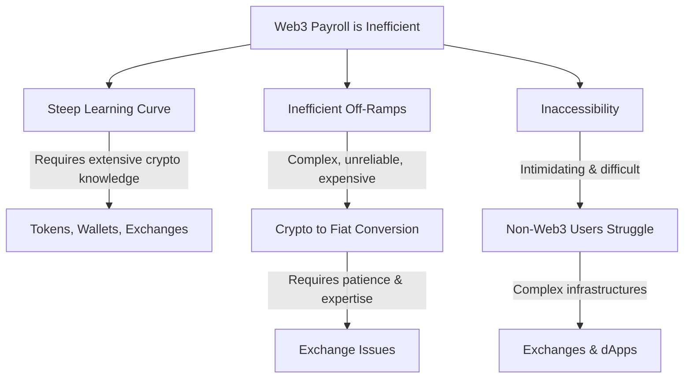
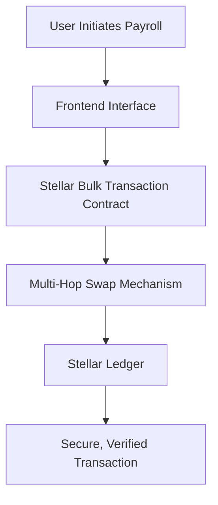
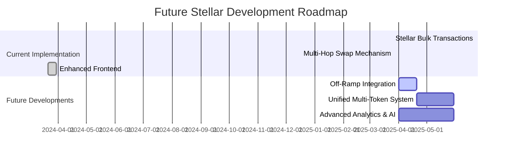

# PayZoll: The Future of Decentralized Payroll on Stellar 🌍💸

Welcome to **PayZoll**, the decentralized payroll platform that leverages blockchain, AI, and the innovative features of the Stellar ecosystem to transform global payroll processing. Designed for both startups and global enterprises, PayZoll ensures secure, efficient, and cost-effective payrolls across borders with multi-token support.

---

## 🚀 Overview

PayZoll bridges the gap between traditional Web2 payroll systems and next-generation Web3 solutions. Our platform has been successfully implemented on multiple chains:
- **EVM Chains:** Basic native transfers, simple logging, and limited security.
  
Now, we are building a more robust and stable version on **Stellar** to fully leverage its advanced blockchain features for secure, bulk, multi-token payroll processing.
Efficient Rust based contracts that have inherent security and scalability. Client side intraction using the Stellar SDK for ease of experience in the product.

---

## The Problem



## 🌟 Current Stellar Integration

### What We Have Built

**1. Stellar Bulk Transaction Contracts**  
- **Purpose:** Execute bulk token transfers across the Stellar chain to optimize payroll processing.  
- **Features:**  
  - **Efficient Bulk Operations:** Processes multiple token transactions in a single operation.  
  - **Security:** Utilizes Stellar’s inherent security measures to maintain transaction integrity.  

**2. Multi-Hop Swap Mechanism**  
- **Purpose:** Enable optimal conversion of tokens by leveraging Stellar’s Rust SDK.  
- **Features:**  
  - **Optimal Routes:** Finds the best conversion path, e.g., from XLM to USDC, ensuring competitive rates.  
  - **Seamless Payroll Operations:** Simplifies cross-currency payroll processing, enhancing user experience.

**3. Enhanced Frontend Experience**  
- **Purpose:** Provide a modern and interactive UI specifically tailored for Stellar-based payroll operations.  
- **Features:**  
  - **Interactive Dashboards:** Visualize transactions and payroll data in real time.  
  - **User-Centric Design:** A clean, responsive interface that supports advanced Stellar features.
  - **Stellar_SDK:** A intuitive and clean usage of the stellar client sdk to have a smooth and efficient interactions with the contract.
    Utilization of freighter wallets and providers for ease of funds usage and validations.

### Visual: Current Stellar Architecture



---

## 🔮 Future Stellar Developments

### What We Plan to Build

**1. Off-Ramp Integration (Planned for Later)**
- **Goal:** Enable seamless conversion from crypto to fiat currencies.
- **Features to Include:**  
  - **Unified Liquidity Pools:** Integrate with Stellar’s on/off ramp features to improve fiat accessibility.
  - **Enhanced User Experience:** Simplify the process for employers and employees to convert crypto earnings into local currencies.
  
**2. Unified Multi-Token Payroll System**
- **Goal:** Create a robust, multi-token payroll processing system.
- **Features to Include:**  
  - **Integrated Pools and Trading Holds:** Support multi-chain payments by managing unified liquidity pools.
  - **Expanded Token Support:** Beyond basic tokens, include a wide variety of assets available on Stellar and other supported chains.
  
**3. Advanced Analytics & AI-Driven Automation Enhancements**
- **Goal:** Increase operational efficiency and accuracy in payroll management.
- **Features to Include:**  
  - **Real-Time Analytics:** Leverage AI to provide insights on payroll trends, risks, and opportunities.
  - **Automated Compliance:** Ensure tax and regulatory compliance across jurisdictions.

### Visual: Future Roadmap for Stellar Integration



---

## 🔗 Multi-Chain Evolution

Our journey has been multi-chain from the start:
- **EVM Chains:** Our initial implementation on Ethereum-based chains focused on native transfers and basic logging.
  
Now, with Stellar, we are building a superior, stable, and feature-rich payroll system that leverages Stellar’s scalability, security, and efficiency to deliver next-level payroll processing.

---

## 📜 Prior Project Disclosure

**Disclosure:**  
PayZoll has evolved through previous hackathons, including ETH India 2024 and BNB Hack Q4. Earlier iterations focused on EVM Chains with basic features and limited security.

### Stellar-Specific Enhancements for This Hackathon

- **What’s Built on Stellar:**  
  - **Bulk Transaction Contracts & Multi-Hop Swap:** New, secure contracts designed specifically for Stellar to optimize payroll processing and token swaps.
  - **Enhanced Frontend:** A redesigned user interface that better supports Stellar’s features and offers superior user experience.
  
- **What’s Coming Next:**  
  - **Off-Ramp Integration:** Planned to enable crypto-to-fiat conversions by leveraging Stellar’s liquidity features.
  - **Unified Multi-Token Payroll System:** Future work will include integrated liquidity pools and support for multiple tokens across chains.
  - **Advanced AI & Analytics:** We aim to further automate compliance and provide deep insights into payroll data.

---

## ⚙️ Getting Started Locally

### Prerequisites
- **Node.js:** JavaScript runtime for the frontend.
- **npm:** Package manager.
- **Hardhat:** Blockchain development framework.
- **Rust & Stellar SDK:** For building and deploying secure Stellar contracts.

### Installation Steps

1. **Clone the Repository**
   ```bash
   git clone https://github.com/PayZoll/PayZoll_Hackathon_Build.git
   ```
2. **Install Root Dependencies**
   ```bash
   npm install
   ```
3. **Setup Frontend**
   ```bash
   cd Frontend
   npm install
   ```
4. **Build and Compile Smart Contracts**
   ```bash
   cd src/blockchain
   npm install
   npx hardhat compile
   ```
5. **Launch the Frontend**
   ```bash
   cd ../..
   cd Frontend
   npm run dev
   ```
6. **Access the Application**
   Open your browser at `http://localhost:5173`

---

## 💰 Revenue Model

While our Stellar off-ramp feature is scheduled for later development, our current revenue model focuses on:
1. **Maintenance Fee:** A fixed fee per employee per month.
2. **Streaming Fee:** A small percentage fee for real-time payroll processing.
3. **Future Fees:** Additional revenue streams will be introduced with off-ramp and unified multi-token features.

---

## 🤝 Contribute & Join the Revolution

We welcome contributions to further refine and expand PayZoll’s Stellar capabilities. To get involved:
1. Fork the repository.
2. Create a new branch (`git checkout -b feature/your-feature`).
3. Commit your changes (`git commit -m "Describe your feature"`).
4. Push your branch (`git push origin feature/your-feature`).
5. Open a Pull Request and join us in shaping the future of payroll.

---

## 🔮 The Future is Stellar with PayZoll

PayZoll is set to redefine payroll processing with its robust, secure, and feature-rich Stellar integration. By building on our multi-chain foundation—initially developed on EVM Chains now focusing on a stable, advanced version on Stellar, we are committed to delivering the best payroll experience in the decentralized era.

**Star us on GitHub** ⭐ | **Fork us** 🍴 | **Join us** 🚀
