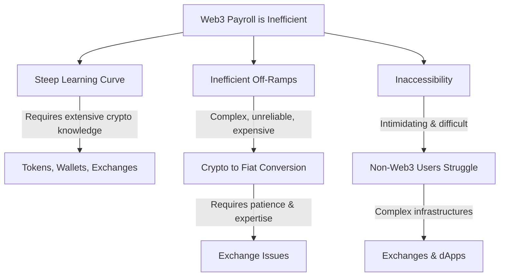
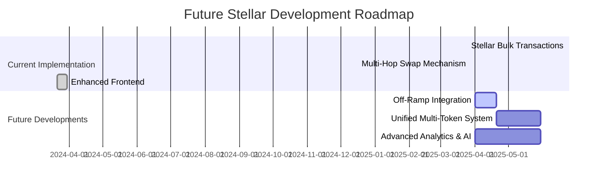

# PayZoll: The Future of Decentralized Payroll on Stellar 🌍💸


Welcome to **PayZoll**, the cutting-edge decentralized payroll platform that harnesses blockchain, AI, and the innovative features of the Stellar ecosystem to revolutionize global payroll processing. Designed for startups and global enterprises alike, PayZoll delivers secure, efficient, and cost-effective payrolls across borders with seamless multi-token support.

---

## Table of Contents

- [Overview](#overview)
- [The Problem](#the-problem)
- [Current Stellar Integration](#current-stellar-integration)
  - [Bulk Transaction Contracts](#bulk-transaction-contracts)
  - [Multi-Hop Swap Mechanism](#multi-hop-swap-mechanism)
  - [Enhanced Frontend Experience](#enhanced-frontend-experience)
- [Future Stellar Developments](#future-stellar-developments)
- [Multi-Chain Evolution](#multi-chain-evolution)
- [Technical Architecture](#technical-architecture)
  - [Bulk Transfer Flow](#bulk-transfer-flow)
  - [Swap-Based Pay Flow](#swap-based-pay-flow)
- [Justification for Technical Decisions](#justification-for-technical-decisions)
- [Team & Expertise](#team--expertise)
- [Deployment & Testing Instructions](#deployment--testing-instructions)
- [Revenue Model](#revenue-model)
- [Contributing](#contributing)
- [License](#license)
- [Contact](#contact)

---

## Overview

PayZoll bridges the gap between traditional Web2 payroll systems and next-generation Web3 solutions. Initially deployed on EVM chains with basic native transfers and logging, we are now leveraging Stellar’s advanced blockchain features to create a robust, secure, and scalable payroll platform. Our solution is built using efficient Rust-based contracts and offers a seamless client-side experience with the Stellar SDK.

---

## The Problem



Traditional Web3 payroll systems face challenges such as:
- **Complexity:** High learning curves for token management, wallet operations, and decentralized exchanges.
- **Inefficient Off-Ramps:** Difficulty in converting crypto to fiat, which leads to increased costs and delays.
- **Accessibility Issues:** Non-Web3 users find it challenging to interact with decentralized systems.

---

## Current Stellar Integration

### Bulk Transaction Contracts

- **Purpose:** Execute bulk token transfers across the Stellar network.
- **Features:**
  - **Efficient Bulk Operations:** Processes multiple token transactions in a single operation.
  - **Enhanced Security:** Leverages Stellar’s robust security measures to maintain transaction integrity.

### Multi-Hop Swap Mechanism

- **Purpose:** Enable optimal token conversions using Stellar’s Rust SDK.
- **Features:**
  - **Optimal Route Discovery:** Finds the best conversion paths (e.g., XLM to USDC) to ensure competitive rates.
  - **Seamless Payroll Operations:** Simplifies cross-currency payroll processing, enhancing the user experience.

### Enhanced Frontend Experience

- **Purpose:** Provide an interactive and modern user interface for Stellar-based payroll operations.
- **Features:**
  - **Interactive Dashboards:** Real-time visualization of transactions and payroll data.
  - **User-Centric Design:** Clean, responsive interfaces utilizing the Stellar SDK and Freighter wallet for smooth interactions.

---

## Future Stellar Developments

### Off-Ramp Integration

- **Goal:** Enable seamless conversion from crypto to fiat currencies.
- **Planned Features:**
  - Unified liquidity pools for efficient on/off ramp transactions.
  - Streamlined user experience for employers and employees converting crypto earnings into local currencies.

### Unified Multi-Chain Payroll System

- **Goal:** Develop a robust system to handle payroll processing across multiple chains.
- **Planned Features:**
  - Integrated liquidity pools and trading holds to support payments across chains.
  - Expanded token support covering a wide range of assets on Stellar and other networks.

### Advanced Analytics & AI-Driven Automation

- **Goal:** Enhance operational efficiency and ensure regulatory compliance.
- **Planned Features:**
  - Real-time analytics powered by AI to provide actionable insights on payroll trends.
  - Automated compliance mechanisms to ensure adherence to tax and regulatory requirements.

#### Future Roadmap Visual



---

## Multi-Chain Evolution

Our journey began on EVM chains with a focus on native transfers and basic logging. With PayZoll, we are now evolving into a superior, feature-rich payroll system built on Stellar—offering unparalleled scalability, security, and efficiency.

---

## Technical Architecture

### Bulk Transfer Flow

1. **Data Verification:**  
   - The contract receives and verifies payroll data (recipients, amounts, etc.).
2. **Token & Balance Checks:**  
   - Confirms valid token addresses and verifies sufficient user balances.
3. **Bulk Sanction & Approval:**  
   - Validated data is processed in a single transaction, reducing overhead.
4. **Notification & Status Updates:**  
   - Final notifications are sent after transaction execution.

*Key Benefits:*  
- Simplified group transfers in one call.
- Reduced transaction fees and improved processing speed.

### Swap-Based Pay Flow

1. **Data Verification:**  
   - Initial verification of payroll data and tokens.
2. **Token & Balance Checks:**  
   - Validates user balances and transaction legitimacy.
3. **Liquidity Check:**  
   - Ensures sufficient liquidity exists in the decentralized pool for swaps.
4. **Fund Transfer & Swap Execution:**  
   - Transfers funds, executes the swap using the liquidity pool, and processes subsequent transfers.
5. **Notification & Status Updates:**  
   - Provides real-time status updates post-transaction.

*Key Benefits:*  
- Leverages a decentralized liquidity pool for optimal token swaps.
- Maintains a trustless environment with real-time swap feasibility calculations.

---

## Justification for Technical Decisions

- **Bulk Transfer Contract:**  
  - **Efficiency:** Aggregates multiple transactions to minimize gas costs and streamline operations.
  - **Reliability:** Utilizes standard, proven protocols to ensure transaction integrity.

- **Swap Pay Contract:**  
  - **Decentralized Liquidity:** Adopts a unified decentralized pool model, preserving our commitment to a trustless system.
  - **Flexibility:** Automatically calculates swap feasibility, ensuring valid and secure transactions.

---

## Team & Expertise

Our team combines deep expertise in blockchain technology and Stellar’s unique architecture:

- **Abhinav:** Cofounder @PayZoll | B.tech CSE from IIIT Guwahati | End to End Dev@ MERN/ Next, Nest , Blockchain Dev @solidity, move, rust | Contract Audit and Security | Built an e-commerce auction agency and ran for 2 years | SDE Intern @JP Morgan


- **Vaibhav:** Founder @PayZoll | B.tech in Computer Science & Engineering from IIIT Guwahati | Proven Entrepreneurial Leader: Successfully managed North-East India operations for an e-commerce startup, leading a team of 100+ and achieving 6-figure monthly sales.

Our team that works on the EVM products that will work on Stellar Mainnet Development:

- **Sahil Saxena:** Ex-SDE2 at Microsoft, Lead Backend Engineer.
- **Ayush Gupta:** AI Lead Researcher at University of Strasbourg.
- **Ayash-Bera:** Lead Web3 Researcher.
- **Aditi Ghosh:** Lead Frontend Developer.

With a strong foundation in Rust and multi-chain development, our team is well-equipped to build and scale the next-generation payroll system on Stellar.

---

## Deployment & Testing Instructions

### Live Environment

- **Access:**  
  The site and smart contracts are fully deployed and operational.  
  Visit our [Live Website](https://payzoll-stellar.onrender.com/)

### Setup Instructions

1. **Install Prerequisites:**  
   - [Node.js](https://nodejs.org/)  
   - [npm](https://www.npmjs.com/)   
   - [Rust & Stellar SDK](https://www.stellar.org/developers/)  

2. **Clone the Repository**

   ```bash
   https://github.com/PayZoll-Orgs/PayZoll-1.0.0-P2
   ```

3. **Install Root Dependencies**

   ```bash
   npm install
   ```

4. **Setup Frontend**

   ```bash
   cd Frontend
   npm install
   ```

5. **Compile Smart Contracts**

   ```bash
   cd Frontend/src/Stellar
   cargo build
   ```

6. **Launch the Frontend**

   ```bash
   cd ../
   npm run dev
   ```

7. **Access the Application:**  
   Open your browser at `http://localhost:5173`

### Testing Credentials

- **Email:** `build@stellar.com`  
- **Password:** `123456789`

> **Note:** Ensure your Freighter wallet is funded with the required tokens before testing.

#### Required Tokens

```plaintext
native: 'CDLZFC3SYJYDZT7K67VZ75HPJVIEUVNIXF47ZG2FB2RMQQVU2HHGCYSC'
usdc:   'CBIELTK6YBZJU5UP2WWQEUCYKLPU6AUNZ2BQ4WWFEIE3USCIHMXQDAMA'
```

---

## Revenue Model

While off-ramp integration is on the roadmap, our current revenue streams include:

1. **Maintenance Fee:**  
   - A fixed fee per employee per month.
2. **Streaming Fee:**  
   - A small percentage fee for real-time payroll processing.
3. **Future Revenue Streams:**  
   - Additional fees will be introduced with off-ramp and unified multi-token functionalities.

---

## Contributing

We welcome contributions to further enhance PayZoll. To contribute:

1. **Fork the Repository**
2. **Create a New Branch**

   ```bash
   git checkout -b feature/your-feature
   ```

3. **Commit Your Changes**

   ```bash
   git commit -m "Add feature: [description]"
   ```

4. **Push to Your Branch**

   ```bash
   git push origin feature/your-feature
   ```

5. **Open a Pull Request**  
   Join us in shaping the future of decentralized payroll!

---

## License

This project is licensed under the [MIT License](LICENSE).

# Contract Details:
**TOKEN ISSUER** - GBDY7MPNHO7CB3GTI632X2WMTA5GS4YTKKEJBTGDBFJALCUKGLA2PETK

**CONTRACT**  - CAAX52OHYPSYCUFTEO4FHQL345SYQD6D7JAGSPOFNMXXQJXO6DAHN3QR

**WASM_HASH** - 0ebde7a3d59aa065fb48d9cb48922abab601783216b9733f74071b441bb16a2a

**LIQUIDITY-PROVIDERS**

GBBYTVWHN3BOLR47BZXQ5E3BVUVYC2JFKJSYNWBU3DANZYUKPC2WBLTG,                         GAJ4L7FY72JDCTRLWRAPUCNZJESEJRJPGQNYZRB25AWA4ZIQLNNGET5L, GBKFQIKIJLKD6LXXEF734QXRMWGZJMOKAWAWASTQGYW3GZGJ7Z3AF4PM, GBDY7MPNHO7CB3GTI632X2WMTA5GS4YTKKEJBTGDBFJALCUKGLA2PETK

**Token**

   **native:** 'CDLZFC3SYJYDZT7K67VZ75HPJVIEUVNIXF47ZG2FB2RMQQVU2HHGCYSC',                         
   **usdc:** 'CBIELTK6YBZJU5UP2WWQEUCYKLPU6AUNZ2BQ4WWFEIE3USCIHMXQDAMA'
   
---

## Contact

For questions or further information, please reach out to us at:

- **Email:** [tech@payzoll.in](mailto:tech@payzoll.in)
- **GitHub Issues:** Use the repository's issue tracker for bug reports or feature requests.

---

**Star us on GitHub** ⭐ | **Fork us** 🍴 | **Join the Revolution** 🚀

*Empowering global payroll with the power of decentralized technology and Stellar’s robust ecosystem.*
